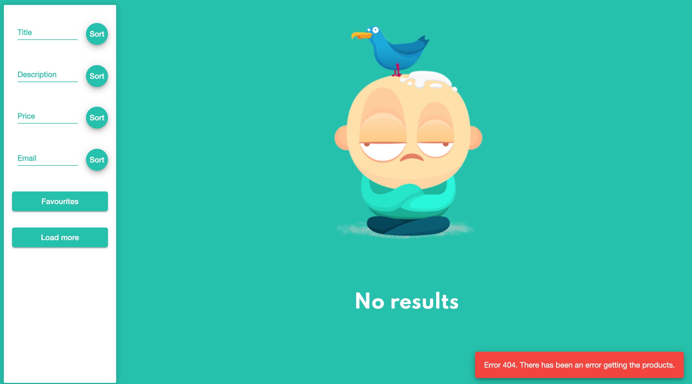
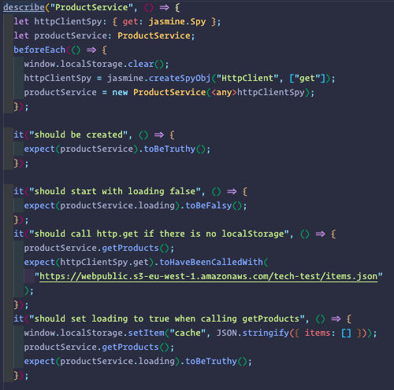

# Wallapop test

Wallapop test is an Angular app, that shows a list products, where the user can:
 - Filter by title, description, price or email. 
 - Sort by title, description, price or email. 
 - Make a favourites list.

## Details

I made the decision to do the following components structure.

I decided to split the different functionalities in **3 main blocks**. First one responsible to render the **product-list**.
The second one, responsible to manage the different **filters**, and the last one responsible to manage **sort by item and sort direction**.

There are two services, the main, is the product service, where we can find the methods to get products, get filters, set filters and manage the loading state.

In this service I made the decision to make **filters and sorters asObservable instead of products**. I did that, because in this app, we have static number of data and the dynamic part, is the manage of this data. So in every change of filters or sorters the data is going to upload automatically.
 
In order to add value to the app, I add in the method which get the data from the URL, a **cache** to keep the data and not to have to call the URL more than ones.

Also in products list components is added a **no results page**. This page appears when the user try to filter and there are no results for this search.

The app also have an **error handling** in loadProducts method, in order to give feedback to the user if the get call has any problem.

In the process of get data, the app shows a **loader spinner**.

Some parts of the app has been **tested with Jasmine**.

I created a **general styles folder** with a colours file. In this file we can find the most use colours in the app. That way make easier to change the palette colours of the app. That file could be done for general size also if the app was bigger.
